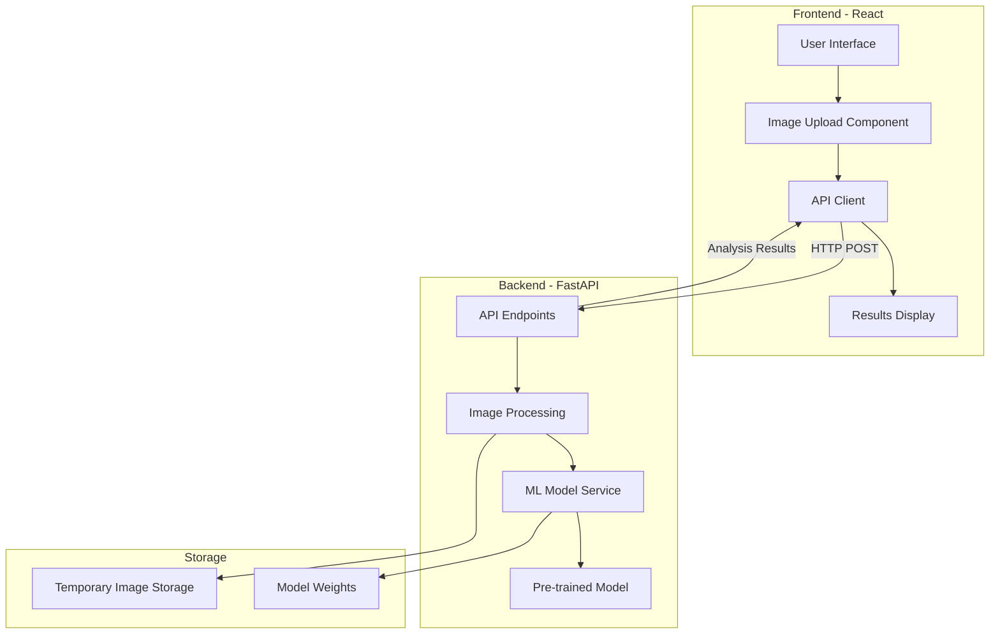

# Deepfake Detector Web Application - Architecture Plan

## Project Overview
A web-based image deepfake detection application using React frontend and Python FastAPI backend with pre-trained ML models.

## System Architecture



## Technology Stack

### Frontend
- **Framework**: React 18+
- **Build Tool**: Vite or Create React App
- **Styling**: Tailwind CSS or Material-UI
- **HTTP Client**: Axios or Fetch API
- **State Management**: React Hooks (useState, useEffect)
- **File Upload**: react-dropzone or native input

### Backend
- **Framework**: FastAPI (Python 3.9+)
- **ML Framework**: PyTorch + Hugging Face Transformers
- **Image Processing**: Pillow (PIL)
- **API Documentation**: Auto-generated with FastAPI (Swagger/OpenAPI)
- **CORS**: fastapi-cors-middleware

### Pre-trained Model (Selected)
**Primary Model**: Vision Transformer (ViT-Large)
- **Source**: Hugging Face (`dima806/deepfake_vs_real_image_detection`)
- **Accuracy**: 97-98% on standard benchmarks
- **Architecture**: Transformer-based with attention mechanisms
- **Integration**: Via transformers library
- **Performance**: 2-4 seconds (CPU), <1 second (GPU)

## Project Structure

```
deepfake-detector/
├── frontend/
│   ├── public/
│   ├── src/
│   │   ├── components/
│   │   │   ├── ImageUpload.jsx
│   │   │   ├── ResultsDisplay.jsx
│   │   │   ├── LoadingSpinner.jsx
│   │   │   └── Header.jsx
│   │   ├── services/
│   │   │   └── api.js
│   │   ├── utils/
│   │   │   └── imageValidation.js
│   │   ├── App.jsx
│   │   └── main.jsx
│   ├── package.json
│   └── vite.config.js
│
├── backend/
│   ├── app/
│   │   ├── main.py
│   │   ├── models/
│   │   │   ├── detector.py
│   │   │   └── model_loader.py
│   │   ├── routes/
│   │   │   └── detection.py
│   │   ├── services/
│   │   │   ├── image_processor.py
│   │   │   └── prediction_service.py
│   │   └── utils/
│   │       └── validators.py
│   ├── models/
│   │   └── pretrained/
│   ├── requirements.txt
│   └── config.py
│
├── README.md
├── ARCHITECTURE.md
└── .gitignore
```

## API Endpoints

### POST /api/detect
Upload and analyze an image for deepfake detection.

**Request:**
- Content-Type: multipart/form-data
- Body: image file (JPEG, PNG)

**Response:**
```json
{
  "success": true,
  "prediction": "real" | "fake",
  "confidence": 0.95,
  "details": {
    "model_used": "vision-transformer-vit",
    "processing_time": 1.23,
    "image_dimensions": [1024, 768]
  }
}
```

### GET /api/health
Health check endpoint.

**Response:**
```json
{
  "status": "healthy",
  "model_loaded": true
}
```

## Key Features

### Core Features
1. **Image Upload**: Drag-and-drop or click to upload
2. **Real-time Analysis**: Process images and return results
3. **Confidence Score**: Display probability of image being fake
4. **Visual Feedback**: Loading states, progress indicators
5. **Error Handling**: Graceful error messages for invalid inputs

### Optional Features (Phase 2)
1. **Batch Processing**: Upload multiple images at once
2. **Analysis History**: Store and view past analyses
3. **Detailed Report**: Heatmaps showing manipulated regions
4. **Export Results**: Download analysis reports as PDF/JSON
5. **Comparison Mode**: Compare multiple images side-by-side

## Implementation Phases

### Phase 1: MVP (Minimum Viable Product)
- Basic project setup
- Single image upload and analysis
- Simple results display
- Core detection functionality

### Phase 2: Enhanced Features
- Improved UI/UX
- Batch processing
- Analysis history
- Better error handling

### Phase 3: Advanced Features
- Heatmap visualization
- Detailed reports
- Performance optimization
- Deployment configuration

## Model Selection Criteria

1. **Accuracy**: >90% on standard benchmarks
2. **Speed**: <3 seconds per image
3. **Size**: <500MB model weights
4. **License**: Open source, commercially usable
5. **Maintenance**: Active community support

## Recommended Pre-trained Models

### Option 1: Vision Transformer (ViT-Large) - Recommended
- **Pros**: State-of-the-art accuracy (97-98%), excellent at detecting subtle artifacts
- **Source**: PyTorch Hub or Hugging Face
- **Size**: ~75MB
- **Accuracy**: ~94% on FaceForensics++

### Option 2: XceptionNet
- **Pros**: Proven for deepfake detection
- **Source**: TensorFlow/Keras
- **Size**: ~88MB
- **Accuracy**: ~95% on standard datasets

### Option 3: Hugging Face Transformers
- **Model**: `dima806/deepfake_vs_real_image_detection`
- **Pros**: Easy integration, pre-configured
- **Framework**: PyTorch
- **Accuracy**: ~92%

## Security Considerations

1. **File Validation**: Check file types, sizes, and content
2. **Rate Limiting**: Prevent API abuse
3. **Temporary Storage**: Auto-delete uploaded images after processing
4. **CORS Configuration**: Restrict allowed origins
5. **Input Sanitization**: Validate all user inputs

## Performance Optimization

1. **Model Caching**: Load model once at startup
2. **Image Preprocessing**: Resize images to optimal dimensions
3. **Async Processing**: Use FastAPI's async capabilities
4. **Response Compression**: Enable gzip compression
5. **CDN for Frontend**: Serve static assets efficiently

## Testing Strategy

1. **Unit Tests**: Test individual components and functions
2. **Integration Tests**: Test API endpoints
3. **E2E Tests**: Test complete user workflows
4. **Model Tests**: Validate detection accuracy
5. **Performance Tests**: Measure response times

## Deployment Options

1. **Frontend**: Vercel, Netlify, or AWS S3 + CloudFront
2. **Backend**: AWS EC2, Google Cloud Run, or Heroku
3. **Containerization**: Docker for consistent deployment
4. **CI/CD**: GitHub Actions for automated deployment

## Development Timeline Estimate

- **Phase 1 (MVP)**: 2-3 days
- **Phase 2 (Enhanced)**: 2-3 days
- **Phase 3 (Advanced)**: 3-4 days
- **Testing & Polish**: 1-2 days

**Total**: 8-12 days for full implementation

## Next Steps

1. Review and approve this architecture plan
2. Set up development environment
3. Begin implementation following the todo list
4. Iterate based on testing and feedback
